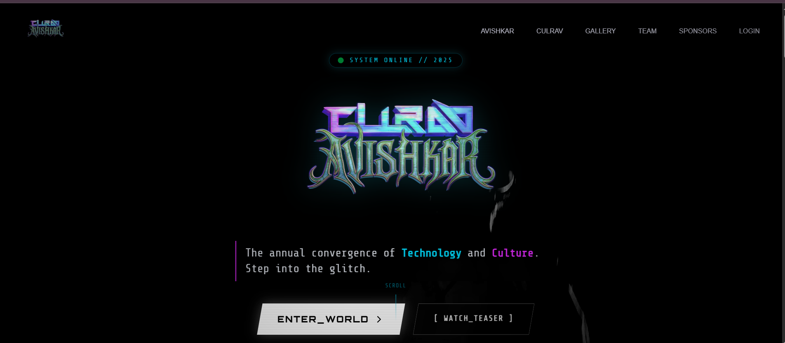
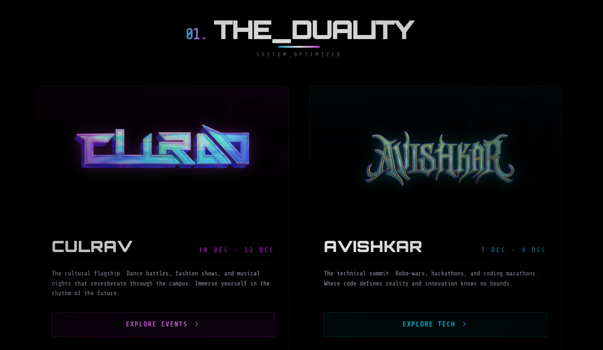
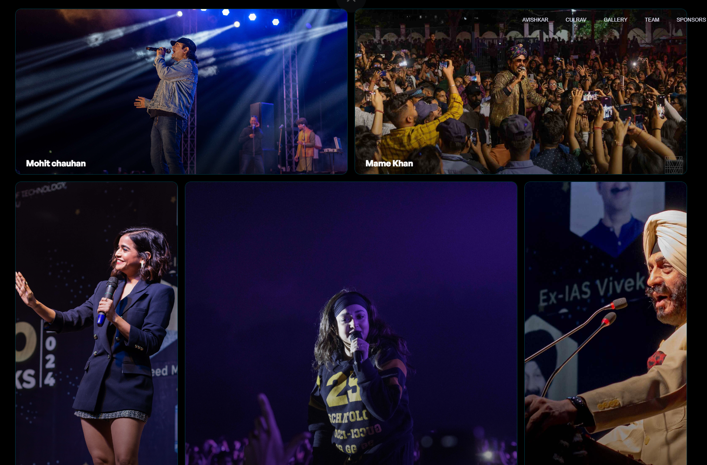
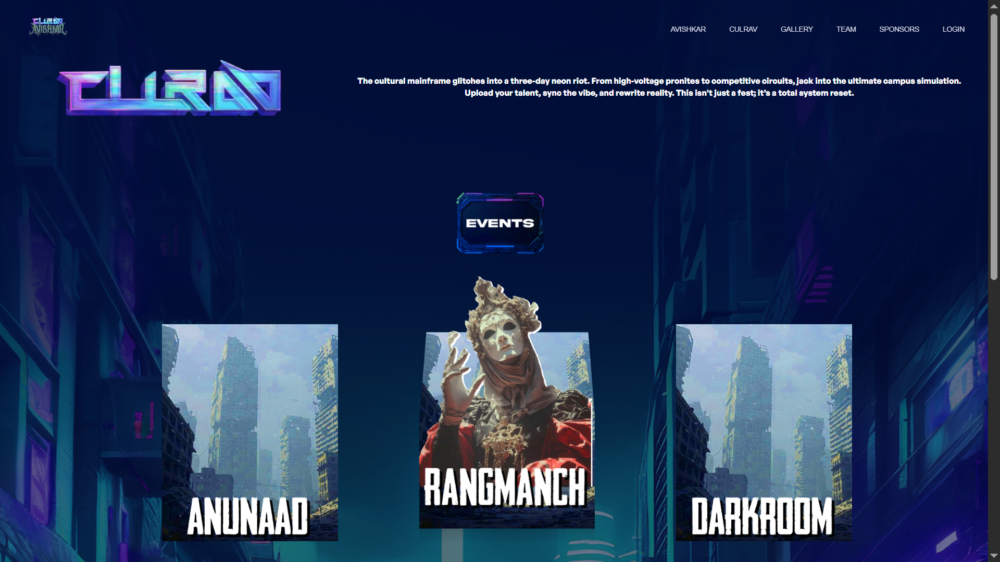
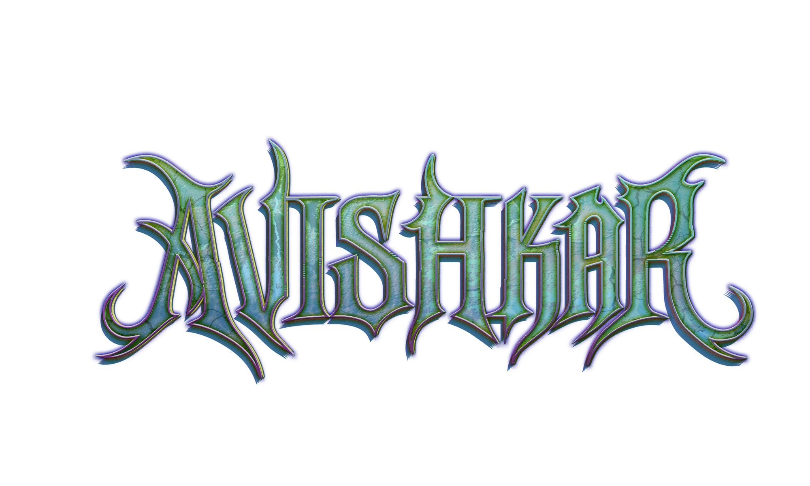
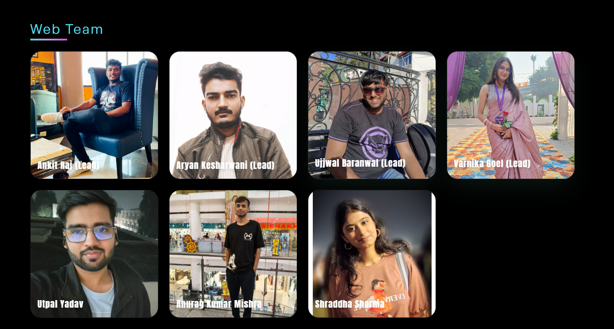

# 🎉 Culrav-Avishkar 2k24 Official Website




Welcome to the Official Culrav-Avishkar 2k25 Website Repository ! This project was built as part of the annual techno-cultural fest of our institute, combining cutting-edge web technologies and teamwork to deliver a seamless user experience.

## Intro
The Website starts off with a sleek animated video asset that was provided by the MHM Team.


## Sneak peak into different Sections of the website :

## We had a sleek gallery section on the home page to show past culrav-avishkar memories


## Events Page , with a captivating and engaging design


## A vibrant banner section showcasing the logos of both the Cultural and Technical fest !




## Team
Introducing you to the Incredible Web Team behind the success. It would not have been possible without them !




## Technologies Used

## React JS


## Express JS


## Redux Toolkit


## Tailwind CSS


## GSAP 


## Framer Motion


## Run Locally

Clone the project

```bash
git clone https://github.com/UjjwalBaranwal/culrav-avishkar-2k25.git
```

Go to the project directory

```bash
cd culrav-avishkar-2k25
```

Install dependencies for both frontend and backend :

```bash
cd server
npm install
cd ..
cd client
npm install

```

Start the backend server:

```bash
cd server
npm start
```
Start the frontend development server:

```bash
cd client
npm run dev
```


## Environment Variables

To run this project, you will need to add the following environment variables to your .env file inside server folder

`MONGO`

`JWT_SECRET`

`SMTP_USER`

`SMTP_HOST`

`CONFIRM_TOKEN_EXPIRES_MIN`

## Vite Configuration
### The vite.config.js file has to be configured according to the proxy API requests to the backend server

```bash
import { defineConfig } from "vite";
import react from "@vitejs/plugin-react";
import tailwindcss from "@tailwindcss/vite";

import path from "path";
import { fileURLToPath } from "url";

// Fix __dirname for ESM
const __filename = fileURLToPath(import.meta.url);
const __dirname = path.dirname(__filename);

export default defineConfig({
  plugins: [react(), tailwindcss()],
  resolve: {
    alias: {
      "@": path.resolve(__dirname, "./src"),
    },
  },
});

```

